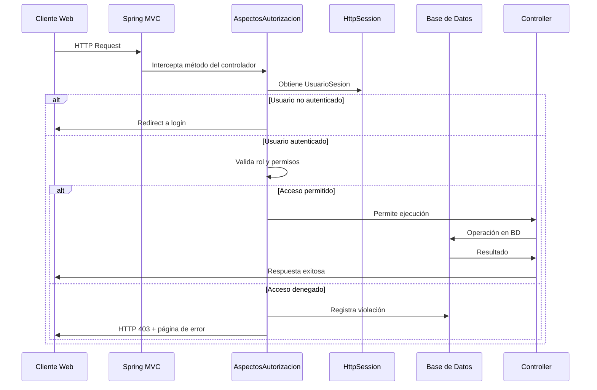

# Documentación Técnica del Sistema de Seguridad Basado en AOP

## Sistema de Notas y Estudiantes - Spring Boot

---

## 1. Introducción y Alcance de la Seguridad

### 1.1 Propósito del Sistema de Seguridad

El sistema de seguridad implementado tiene como objetivo principal **controlar el acceso** a las funcionalidades de gestión de estudiantes y notas académicas, garantizando que:

- Los **alumnos** solo puedan visualizar sus propias notas y no puedan realizar modificaciones
- Los **profesores** tengan acceso completo para crear, editar y eliminar tanto estudiantes como notas
- Se registren todas las **violaciones de seguridad** para auditoría y monitoreo
- El sistema sea **robusto** ante intentos de acceso no autorizado

### 1.2 Contexto de la Aplicación

La aplicación simula un **sistema académico básico** donde:

- **Profesores** gestionan estudiantes y sus notas (operaciones CRUD completas)
- **Alumnos** consultan únicamente sus propias calificaciones (solo lectura)
- El acceso se controla mediante **sesiones HTTP** y **Programación Orientada a Aspectos (AOP)**

### 1.3 Roles del Sistema

| Rol            | Descripción                       | Permisos                                                                                                                                                |
| -------------- | --------------------------------- | ------------------------------------------------------------------------------------------------------------------------------------------------------- |
| `ROL_ALUMNO`   | Estudiante que consulta sus notas | - Visualizar solo sus propias notas<br>- Calcular su promedio académico<br>- Ver lista de estudiantes (solo visualización)                              |
| `ROL_PROFESOR` | Docente con acceso administrativo | - Acceso completo a todas las funcionalidades<br>- CRUD de estudiantes<br>- CRUD de notas de cualquier estudiante<br>- Acceso a reportes y estadísticas |

---

## 2. Decisiones de Diseño del Sistema de Seguridad

### 2.1 Justificación del Uso de AOP

**¿Por qué Programación Orientada a Aspectos?**

La implementación basada en AOP se seleccionó por las siguientes razones técnicas:

#### **Ventajas de AOP en este Sistema:**

1. **Separación de Preocupaciones (Separation of Concerns)**

   - La lógica de seguridad está **centralizada** en clases de aspectos
   - Los controladores y servicios se enfocan en la lógica de negocio
   - Mantenimiento simplificado: cambios de seguridad en un solo lugar

2. **Intercepción Transparente**

   - Los aspectos interceptan métodos **automáticamente** sin modificar el código original
   - No requiere modificaciones en controladores existentes
   - Aplicación consistente de reglas de seguridad

3. **Flexibilidad de Configuración**

   - Los **pointcuts** permiten seleccionar métodos específicos para asegurar
   - Fácil adición/modificación de reglas sin afectar funcionalidad existente
   - Configuración declarativa mediante anotaciones

4. **Auditoría Integrada**
   - Logging automático de todas las operaciones interceptadas
   - Registro detallado de violaciones de seguridad en base de datos
   - Trazabilidad completa de acciones del usuario

### 2.2 Mecanismo de Autenticación: Sesiones HTTP (No JWT)

**¿Por qué NO se utiliza JWT?**

El sistema utiliza **sesiones HTTP tradicionales** de Spring Boot en lugar de JWT por las siguientes razones:

#### **Razones para No Usar JWT:**

1. **Simplicidad de Implementación**

   - Las sesiones HTTP están **integradas nativamente** en Spring Boot
   - No requiere configuración adicional de seguridad JWT

2. **Contexto de Aplicación**

   - Es una **aplicación web tradicional** (no API REST pura)
   - Uso de plantillas Thymeleaf que se benefician del estado de sesión

3. **Seguridad Adecuada para el Contexto**

   - Las sesiones HTTP son **suficientemente seguras** para este sistema académico
   - Invalidación inmediata al cerrar sesión

4. **Gestión de Estado**
   - La información del usuario (`UsuarioSesion`) se mantiene **en memoria del servidor**
   - Acceso directo y rápido sin necesidad de decodificar tokens

#### **Mecanismo Implementado:**

```java
// En LoginController.java - Líneas 54-56
UsuarioSesion usuario = new UsuarioSesion(nombre.trim(), rol, estudianteId);
session.setAttribute("usuario", usuario);
```

La autenticación se realiza mediante:

- **Identificación simple** por nombre y rol
- Almacenamiento en **HttpSession**
- Validación de existencia del estudiante en base de datos

### 2.3 Estrategia de los Aspectos

#### **Diseño de la Clase `AspectosAutorizacion`**

**Estructura del Aspecto:**

1. **Pointcuts Declarativos** (Líneas 62-116)

   - Definición de puntos de interceptación específicos
   - Agrupación lógica por tipo de operación
   - Reutilización en múltiples advice

2. **Advice Types Utilizados:**

   - **`@Before`**: Validación previa a la ejecución
   - **`@Around`**: Control completo del flujo de ejecución

3. **Categorías de Pointcuts:**

```java
// Operaciones de lectura
@Pointcut("execution(* com.ejemplo.notasapp.controlador.NotaController.listar(..))")
public void operacionesLecturaNotas() {}

// Operaciones de escritura
@Pointcut("execution(* com.ejemplo.notasapp.controlador.NotaController.nueva(..))")
public void operacionesEscrituraCrear() {}

// Gestión de estudiantes
@Pointcut("execution(* com.ejemplo.notasapp.controlador.EstudianteController.nuevo(..))")
public void operacionesCrearEstudiante() {}
```

#### **Tipos de Advice y su Justificación:**

| Advice Type | Uso en el Sistema                      | Justificación                                                 |
| ----------- | -------------------------------------- | ------------------------------------------------------------- |
| `@Before`   | Validación de operaciones de escritura | **Bloqueo inmediato** - no permite que la operación inicie    |
| `@Around`   | Control de acceso a datos específicos  | **Control granular** - puede modificar parámetros o resultado |

### 2.4 Manejo de Propiedad de Datos

**Principio:** "Un alumno solo puede acceder a sus propias notas"

**Implementación:**

1. **Validación por ID de Estudiante** (Líneas 198-232)

```java
@Around("operacionesLecturaNotas() || operacionesLecturaPromedio() || operacionesCalculoPromedio()")
public Object validarAccesoNotasPropiasAlumno(ProceedingJoinPoint joinPoint) throws Throwable {
    // Extrae estudianteId del PathVariable
    // Compara con usuario.getEstudianteId()
    // Bloquea si no coinciden
}
```

2. **Validación por ID de Nota** (Líneas 275-359)

```java
@Around("execution(* com.ejemplo.notasapp.controlador.NotaController.editar(Long, ..)) ||" +
        "execution(* com.ejemplo.notasapp.controlador.NotaController.eliminar(Long))")
public Object validarAccesoNotaPorIdAlumno(ProceedingJoinPoint joinPoint) throws Throwable {
    // Consulta la nota en base de datos
    // Verifica el propietario de la nota
    // Bloquea si el alumno no es el propietario
}
```

---

## 3. Funcionamiento Detallado del Sistema de Seguridad

### 3.1 Flujo de una Petición Segura

**Secuencia Completa de Validación:**



#### **Paso a Paso Detallado:**

1. **Recepción de Petición HTTP**

   ```
   GET /notas/123 HTTP/1.1
   Cookie: JSESSIONID=ABC123...
   ```

2. **Intercepción por Aspecto**

   - Spring AOP detecta que el método coincide con un pointcut
   - Se ejecuta el advice correspondiente ANTES del método del controlador

3. **Extracción de Identidad**

   ```java
   // En AspectosAutorizacion.java - Líneas 419-436
   private UsuarioSesion obtenerUsuarioSesion() {
       ServletRequestAttributes attrs = (ServletRequestAttributes) RequestContextHolder.getRequestAttributes();
       HttpServletRequest request = attrs.getRequest();
       HttpSession session = request.getSession(false);
       return (UsuarioSesion) session.getAttribute("usuario");
   }
   ```

4. **Validación de Permisos**

   - Verificación del rol del usuario
   - Validación de acceso al recurso específico
   - Comprobación de propiedad de datos (para alumnos)

5. **Decisión de Acceso**
   - **Permitido**: Continúa la ejecución normal
   - **Denegado**: Lanza `ViolacionSeguridad` exception

### 3.2 Reglas Específicas por Rol

#### **ROL_ALUMNO - Restricciones Implementadas:**

| Operación                 | Endpoint                    | Validación                                     | Resultado        |
| ------------------------- | --------------------------- | ---------------------------------------------- | ---------------- |
| **Ver notas propias**     | `GET /notas/{estudianteId}` | ✅ `estudianteId == usuario.getEstudianteId()` | HTTP 200 + datos |
| **Ver notas ajenas**      | `GET /notas/{otroId}`       | ❌ `otroId != usuario.getEstudianteId()`       | HTTP 403 + error |
| **Crear nota**            | `POST /notas`               | ❌ Operación de escritura                      | HTTP 403 + error |
| **Editar nota**           | `PUT /notas/{id}`           | ❌ Operación de escritura                      | HTTP 403 + error |
| **Eliminar nota**         | `DELETE /notas/{id}`        | ❌ Operación de escritura                      | HTTP 403 + error |
| **Gestionar estudiantes** | `POST /estudiantes`         | ❌ Solo profesores                             | HTTP 403 + error |

**Código de Validación para Alumnos:**

```java
// Validación de operaciones de escritura - Líneas 126-147
@Before("operacionesEscrituraCrear() || operacionesEscrituraGuardar() || ...")
public void validarOperacionesEscrituraAlumno(JoinPoint joinPoint) {
    UsuarioSesion usuario = obtenerUsuarioSesion();
    if (usuario != null && usuario.isAlumno()) {
        registrarViolacionSeguridad(usuario, accionIntentada, detalles);
        throw ViolacionSeguridad.operacionNoPermitida(/* ... */);
    }
}
```

#### **ROL_PROFESOR - Acceso Completo:**

POR EXPLICAR ....

## 4. Gestión y Configuración de los Aspectos

### 4.1 Ubicación y Estructura del Código

**Estructura del Proyecto:**

```
src/main/java/com/ejemplo/notasapp/
├── aspecto/
│   ├── AspectosAutorizacion.java    # Aspectos principales de seguridad
│   └── Aspectos.java               # Aspectos auxiliares/logging
├── excepcion/
│   └── ViolacionSeguridad.java     # Excepción personalizada
├── modelo/
│   ├── UsuarioSesion.java          # Modelo de usuario en sesión
│   └── LogViolacionSeguridad.java  # Entidad para auditoría
└── controlador/
    ├── LoginController.java        # Gestión de autenticación
    ├── NotaController.java         # CRUD de notas
    └── EstudianteController.java   # CRUD de estudiantes
```

### 4.2 Fragmentos de Código Clave

#### **Definición de Pointcuts Estratégicos:**

```java
// Líneas 62-90 - Pointcuts para operaciones de notas
@Pointcut("execution(* com.ejemplo.notasapp.controlador.NotaController.listar(..))")
public void operacionesLecturaNotas() {}

@Pointcut("execution(* com.ejemplo.notasapp.controlador.NotaController.nueva(..))")
public void operacionesEscrituraCrear() {}
```

**Explicación:** Los pointcuts utilizan **expresiones de ejecución** que interceptan métodos específicos basándose en:

- **Paquete y clase** de destino
- **Nombre del método**
- **Parámetros** (`(..)` = cualquier parámetro)

#### **Validación de Acceso con @Around:**

```java
// Líneas 198-232 - Control granular de acceso
@Around("operacionesLecturaNotas() || operacionesLecturaPromedio() || operacionesCalculoPromedio()")
public Object validarAccesoNotasPropiasAlumno(ProceedingJoinPoint joinPoint) throws Throwable {
    UsuarioSesion usuario = obtenerUsuarioSesion();

    if (usuario != null && usuario.isAlumno()) {
        Object[] args = joinPoint.getArgs();
        if (args.length > 0 && args[0] instanceof Long) {
            Long estudianteIdSolicitado = (Long) args[0];

            if (!usuario.puedeAccederAEstudiante(estudianteIdSolicitado)) {
                registrarViolacionSeguridad(usuario, metodo, detalles);
                throw ViolacionSeguridad.accesoNoAutorizado(/* ... */);
            }
        }
    }

    return joinPoint.proceed(); // Continúa ejecución si está autorizado
}
```

**Funcionalidades Clave:**

- **`joinPoint.getArgs()`**: Acceso a parámetros del método interceptado
- **`joinPoint.proceed()`**: Continúa con la ejecución original
- **Validación condicional**: Solo aplica restricciones a alumnos

#### **Registro de Violaciones:**

```java
// Líneas 438-473 - Auditoría automática
private void registrarViolacionSeguridad(UsuarioSesion usuario, String accionIntentada, String detalles) {
    LogViolacionSeguridad log = new LogViolacionSeguridad(
        usuario.getNombre(), usuario.getRol(), accionIntentada, detalles
    );

    LogViolacionSeguridad logGuardado = repositorioLog.save(log);
    repositorioLog.flush(); // Persistencia inmediata

    // Logging detallado en consola
    System.out.println("=== VIOLACIÓN DE SEGURIDAD DETECTADA ===");
    System.out.println("Usuario: " + usuario.getNombre());
    System.out.println("Acción intentada: " + accionIntentada);
    // ...
}
```

### 4.3 Configuración de Spring Boot

#### **Dependencias Maven (pom.xml):**

```xml
<!-- Spring Boot AOP - Líneas 80-82 -->
<dependency>
    <groupId>org.springframework.boot</groupId>
    <artifactId>spring-boot-starter-aop</artifactId>
</dependency>

<!-- AspectJ Runtime - Líneas 84-87 -->
<dependency>
    <groupId>org.aspectj</groupId>
    <artifactId>aspectjrt</artifactId>
</dependency>

<!-- AspectJ Weaver - Líneas 89-92 -->
<dependency>
    <groupId>org.aspectj</groupId>
    <artifactId>aspectjweaver</artifactId>
</dependency>
```

#### **Configuración de Base de Datos (application.properties):**

```properties
# Configuración H2 para desarrollo
spring.datasource.url=jdbc:h2:file:./data/notasdb
spring.datasource.driverClassName=org.h2.Driver
spring.datasource.username=sa
spring.datasource.password=

# Habilitación de consola H2
spring.h2.console.enabled=true

# JPA/Hibernate
spring.jpa.hibernate.ddl-auto=update
spring.jpa.show-sql=true
```

---

## 5. Guía de Pruebas

### 5.1 Prerrequisitos para las Pruebas

#### **Ejecución de la Aplicación:**

1. **Compilar y ejecutar:**

   ```bash
   mvn clean compile
   mvn spring-boot:run
   ```

2. **Acceso a la aplicación:**

   - URL: `http://localhost:8080`
   - Consola H2: `http://localhost:8080/h2-console`

### 5.2 Escenarios de Prueba para ROL_ALUMNO

#### **Configuración Inicial:**

- Acceder a `http://localhost:8080`
- Llenar formulario: Nombre="Juan Pérez", Rol="ALUMNO", Estudiante ID=1

#### **5.2.1 Acceso Permitido:**

**Prueba A1: Visualizar Notas Propias**

```
PETICIÓN:
- Método: GET
- URL: http://localhost:8080/notas/1
- Sesión: Usuario "Juan Pérez" (ALUMNO, estudiante_id=1)

RESULTADO ESPERADO:
- Código HTTP: 200 OK
- Contenido: Lista de notas del estudiante ID 1
```

**Prueba A2: Calcular Promedio Propio**

```
PETICIÓN:
- Método: GET
- URL: http://localhost:8080/notas/1/promedio
- Sesión: Usuario "Juan Pérez" (ALUMNO, estudiante_id=1)

RESULTADO ESPERADO:
- Código HTTP: 200 OK
```

#### **5.2.2 Acceso Denegado:**

**Prueba B1: Intentar Ver Notas de Otro Estudiante**

```
PETICIÓN:
- Método: GET
- URL: http://localhost:8080/notas/2
- Sesión: Usuario "Juan Pérez" (ALUMNO, estudiante_id=1)

RESULTADO ESPERADO:
- Código HTTP: 403 Forbidden
- Redirección: /error/violacion-seguridad
- Mensaje: "Los alumnos solo pueden acceder a sus propias notas"
- Log en BD: Registro en tabla log_violacion_seguridad
```

**Prueba B2: Intentar Crear Nueva Nota**

```
PETICIÓN:
- Método: GET
- URL: http://localhost:8080/notas/nueva
- Sesión: Usuario "Juan Pérez" (ALUMNO, estudiante_id=1)

RESULTADO ESPERADO:
- Código HTTP: 403 Forbidden
- Excepción: ViolacionSeguridad.operacionNoPermitida
- Mensaje: "Los alumnos no pueden realizar operaciones de escritura"
- Aspecto interceptor: validarOperacionesEscrituraAlumno()
```

**Prueba B3: Intentar Editar Nota Propia**

```
PETICIÓN:
- Método: GET
- URL: http://localhost:8080/notas/editar/1
- Sesión: Usuario "Juan Pérez" (ALUMNO, estudiante_id=1)

RESULTADO ESPERADO:
- Código HTTP: 403 Forbidden
- Razón: Aunque la nota le pertenece, es operación de escritura
- Aspecto interceptor: validarOperacionesEscrituraAlumno() (ejecuta ANTES que validarAccesoNotaPorIdAlumno)
```

**Prueba B4: Intentar Eliminar Nota**

```
PETICIÓN:
- Método: POST
- URL: http://localhost:8080/notas/eliminar/1
- Sesión: Usuario "Juan Pérez" (ALUMNO, estudiante_id=1)

RESULTADO ESPERADO:
- Código HTTP: 403 Forbidden
- Interceptación: @Before en validarOperacionesEscrituraAlumno()
- Sin acceso a la base de datos (bloqueado antes de ejecutar)
```

**Prueba B5: Intentar Gestionar Estudiantes**

```
PETICIÓN:
- Método: GET
- URL: http://localhost:8080/estudiantes/nuevo
- Sesión: Usuario "Juan Pérez" (ALUMNO, estudiante_id=1)

RESULTADO ESPERADO:
- Código HTTP: 403 Forbidden
- Aspecto interceptor: validarAccesoGeneralEstudiantesController()
- Mensaje: "Los alumnos no pueden gestionar estudiantes"
```

### 5.3 Escenarios de Prueba para ROL_PROFESOR

#### **Configuración Inicial:**

- Acceder a `http://localhost:8080`
- Llenar formulario: Nombre="Dr. Rodríguez", Rol="PROFESOR"

#### **5.3.1 Acceso Completo Permitido:**

**Prueba C1: Ver Notas de Cualquier Estudiante**

```
PETICIÓN:
- Método: GET
- URL: http://localhost:8080/notas/1, /notas/2, /notas/3
- Sesión: Usuario "Dr. Rodríguez" (PROFESOR)

RESULTADO ESPERADO:
- Código HTTP: 200 OK para todas las URLs
- Contenido: Notas completas de cada estudiante
- Funcionalidad: Botones de editar/eliminar disponibles
- Validación: usuario.isProfesor() = true, aspectos permiten ejecución
```

**Prueba C2: Crear Nueva Nota**

```
PETICIÓN:
- Método: POST
- URL: http://localhost:8080/notas/guardar
- Datos: materia="Física", calificacion=89.0, estudiante_id=1
- Sesión: Usuario "Dr. Rodríguez" (PROFESOR)

RESULTADO ESPERADO:
- Código HTTP: 302 Redirect (a lista de notas)
- Acción: Nueva nota creada en BD
- Validación: Aspectos no interceptan (rol profesor)
```

**Prueba C3: Editar Nota Existente**

```
PETICIÓN:
- Método: POST
- URL: http://localhost:8080/notas/guardar/1
- Datos: materia="Matemáticas", calificacion=90.0
- Sesión: Usuario "Dr. Rodríguez" (PROFESOR)

RESULTADO ESPERADO:
- Código HTTP: 302 Redirect
- Acción: Nota ID 1 actualizada en BD
- Verificación: nueva calificación = 90.0
```

**Prueba C4: Eliminar Nota**

```
PETICIÓN:
- Método: POST
- URL: http://localhost:8080/notas/eliminar/5
- Sesión: Usuario "Dr. Rodríguez" (PROFESOR)

RESULTADO ESPERADO:
- Código HTTP: 302 Redirect
- Acción: Nota ID 5 eliminada de BD
- Verificación: SELECT COUNT(*) FROM nota WHERE id=5 → 0
```

**Prueba C5: Gestión de Estudiantes**

```
PETICIÓN:
- Método: GET/POST
- URLs: /estudiantes, /estudiantes/nuevo, /estudiantes/editar/1
- Sesión: Usuario "Dr. Rodríguez" (PROFESOR)

RESULTADO ESPERADO:
- Código HTTP: 200 OK para todas las operaciones
- Funcionalidad: CRUD completo disponible
- Acceso: Sin restricciones por aspectos
```

#### **5.4.2 Verificación de Logging:**

**Consola de aplicación debe mostrar:**

```
=== VIOLACIÓN DE SEGURIDAD DETECTADA ===
ID Log: 1
Usuario: Juan Pérez
Rol: ALUMNO
Estudiante ID: 1
Acción intentada: listar
Detalles: Intento de acceder a notas de estudiante ID: 2, pero el usuario autenticado corresponde al estudiante ID: 1
Fecha/Hora: 2024-12-XX XX:XX:XX
=========================================
```

#### **5.4.3 Endpoint de Debug:**

**Acceso a logs de violaciones:**

```
URL: http://localhost:8080/debug/logs
Método: GET
Resultado: Lista textual de todas las violaciones registradas
```

**Ejemplo de salida:**

```
=== LOGS DE VIOLACIONES DE SEGURIDAD ===
Total de registros: 3

ID: 1
Usuario: Juan Pérez
Rol: ALUMNO
Acción: listar
Detalles: Intento de acceder a notas de estudiante ID: 2...
Fecha/Hora: 2024-12-XX XX:XX:XX
----------------------------------------
```

## 6. Conclusión

### Resumen del Sistema Implementado

El sistema de seguridad basado en **AOP y sesiones HTTP** proporciona:

1. **Control de acceso granular** mediante aspectos especializados
2. **Auditoría completa** de violaciones de seguridad

### Consideraciones de Seguridad

- **Autenticación simple** apropiada para entorno practica del taller
